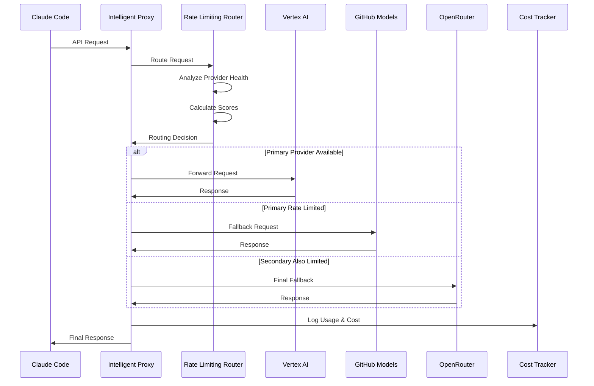

# Architecture Documentation

## System Overview

The Claude Code Multi-Model Integration is designed as a sophisticated proxy system that provides intelligent routing, rate limiting detection, and cost optimization for multiple AI model providers.

## Core Components

### 1. Intelligent Proxy (`core/intelligent_proxy.py`)
The main orchestrator that:
- Receives requests from Claude Code
- Coordinates with the Rate Limiting Router
- Manages provider fallback logic
- Tracks costs and performance metrics
- Provides health monitoring and statistics

### 2. Rate Limiting Router (`core/rate_limiting_router.py`)
The brain of the system that:
- Monitors provider health and rate limits
- Implements intelligent routing strategies
- Calculates provider scores based on multiple factors
- Manages fallback sequences
- Tracks request history and token usage

### 3. Provider Proxies (`proxy/`)
Individual proxies for each provider:
- **GitHub Models Proxy**: Converts Anthropic API to GitHub Models format
- **OpenRouter Proxy**: Handles OpenRouter API with intelligent model selection
- **Vertex AI**: Direct integration with Google Cloud Vertex AI

### 4. Cost Tracking System (`monitoring/`)
Comprehensive cost monitoring:
- **Cost Tracker**: Real-time usage and cost tracking with SQLite database
- **Dashboard**: Web-based monitoring interface
- **Claude Costs Integration**: Integration with existing claude-code-costs tool

## Data Flow

## Routing Strategies

### 1. Intelligent Routing (Default)
Multi-factor scoring system:
- **Rate Limit Avoidance** (Weight: 0.4): Heavily penalizes providers approaching limits
- **Performance** (Weight: 0.3): Favors providers with faster response times
- **Cost** (Weight: 0.2): Considers per-token costs
- **Reliability** (Weight: 0.1): Based on success rates

### 2. Cost Optimization
Pure cost-based routing:
- Calculates estimated cost per request
- Routes to cheapest available provider
- Maintains fallback to more expensive but available providers

### 3. Performance Optimization
Latency-focused routing:
- Routes to provider with lowest average response time
- Considers current load and recent performance
- Balances speed with reliability

### 4. Availability Focus
Reliability-centered routing:
- Prioritizes providers with highest success rates
- Avoids recently failed providers
- Ensures maximum uptime

## Rate Limiting Detection

### Proactive Detection
1. **Request Rate Monitoring**: Tracks requests per minute per provider
2. **Token Usage Tracking**: Monitors token consumption against known limits
3. **Threshold-Based Switching**: Switches providers at 80% of rate limit (configurable)

### Reactive Detection
1. **HTTP 429 Handling**: Immediately detects rate limit responses
2. **Header Parsing**: Extracts rate limit information from response headers
3. **Exponential Backoff**: Implements intelligent retry logic

### Recovery Logic
1. **Reset Time Tracking**: Monitors when rate limits will reset
2. **Gradual Re-enablement**: Slowly reintroduces providers after reset
3. **Health Scoring**: Adjusts provider scores based on recent rate limit history

## Cost Tracking Architecture

### Data Collection
- **Request-level tracking**: Every API call logged with token usage and cost
- **Provider-specific costs**: Different pricing models per provider
- **Real-time aggregation**: Live cost calculations and alerts

### Storage
- **SQLite Database**: Local storage for cost and usage data
- **Prometheus Metrics**: Time-series data for monitoring and alerting
- **JSON Logs**: Structured logs for detailed analysis

### Reporting
- **Real-time Dashboard**: Live cost and usage monitoring
- **API Endpoints**: Programmatic access to cost data
- **Integration**: Seamless integration with claude-code-costs tool

## Fallback Mechanism

### Cascade Logic
1. **Primary Provider**: Highest-scored provider based on current strategy
2. **Secondary Options**: Up to 3 fallback providers in order of preference
3. **Intelligent Delays**: Configurable delays between fallback attempts
4. **Circuit Breaker**: Temporary provider disabling after repeated failures

### Failure Handling
- **Timeout Management**: Per-provider timeout configuration
- **Error Classification**: Different handling for rate limits vs. server errors
- **Health Recovery**: Automatic re-enablement of recovered providers

## Security and Authentication

### API Security
- **Optional Authentication**: Bearer token authentication for admin endpoints
- **CORS Configuration**: Properly configured cross-origin resource sharing
- **Request Validation**: Input validation and sanitization

### Provider Security
- **Credential Management**: Secure handling of API keys and tokens
- **TLS/HTTPS**: Encrypted communication with all providers
- **Error Sanitization**: Prevents credential leakage in error messages

## Monitoring and Observability

### Health Monitoring
- **Provider Health Checks**: Regular health assessments
- **System Metrics**: Request rates, success rates, response times
- **Alert System**: Configurable alerts for cost and performance thresholds

### Logging
- **Structured Logging**: JSON-formatted logs with relevant context
- **Log Levels**: Configurable log levels for different environments
- **Request Tracing**: Request ID tracking across the system

### Metrics
- **Prometheus Integration**: Standard metrics for monitoring systems
- **Custom Metrics**: Domain-specific metrics for AI model usage
- **Grafana Compatibility**: Ready for dashboard visualization

## Scalability Considerations

### Horizontal Scaling
- **Stateless Design**: Proxy instances can be scaled horizontally
- **Shared State**: Cost tracking and provider health shared via database
- **Load Balancing**: Multiple proxy instances can handle increased load

### Performance Optimization
- **Async Architecture**: Non-blocking I/O for high concurrency
- **Connection Pooling**: Efficient HTTP connection management
- **Caching**: Strategic caching of provider health and model information

### Resource Management
- **Memory Management**: Bounded request history and efficient data structures
- **Database Optimization**: Indexed queries and cleanup procedures
- **Garbage Collection**: Regular cleanup of old data and logs

## Configuration Management

### Environment Variables
- **Runtime Configuration**: Key settings configurable via environment variables
- **Provider Settings**: Per-provider configuration for endpoints and limits
- **Feature Flags**: Enable/disable specific features and strategies

### File-based Configuration
- **Provider Configs**: Detailed provider settings in separate files
- **Model Mapping**: Configurable model name mapping between providers
- **Cost Tables**: Updatable cost information for accurate tracking

## Deployment Options

### Local Development
- **Single Machine**: All components running on localhost
- **Docker Support**: Containerized deployment option
- **Development Tools**: Hot reloading and debug modes

### Production Deployment
- **Cloud Ready**: Designed for cloud deployment (AWS, GCP, Azure)
- **Container Orchestration**: Kubernetes and Docker Swarm compatible
- **Load Balancer Integration**: Ready for production load balancing

### Monitoring Integration
- **Prometheus/Grafana**: Standard monitoring stack integration
- **APM Tools**: Application Performance Monitoring compatibility
- **Log Aggregation**: ELK stack and similar log aggregation systems