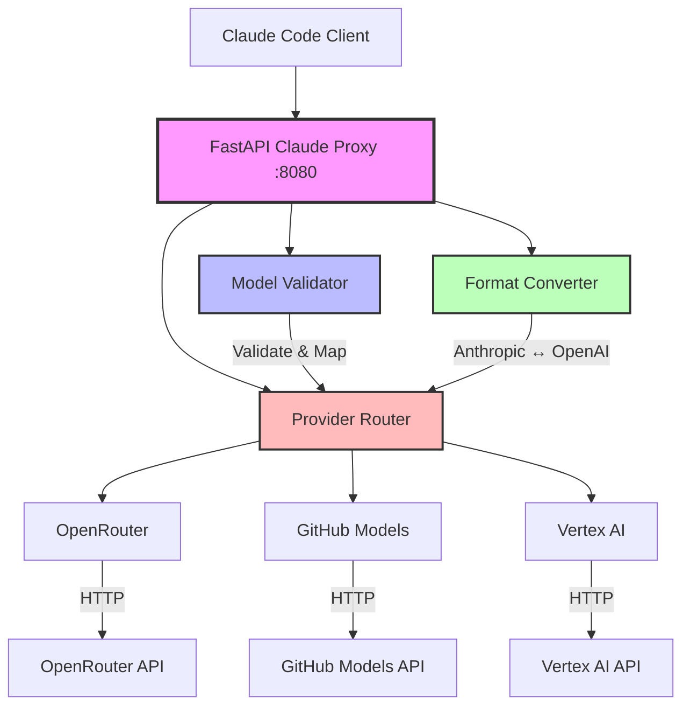

# FastAPI Claude Proxy - Technical Documentation

## Overview

The FastAPI Claude Proxy is a standalone proxy server that provides full Anthropic API compatibility while routing requests through multiple LLM providers. It was developed to replace the problematic LiteLLM unified proxy configuration.

## Architecture



## Key Components

### 1. Model Validation & Mapping

The proxy implements intelligent model mapping through Pydantic validators:

```python
@field_validator('model')
def validate_and_map_model(cls, v):
    model_mappings = {
        # Haiku models (small/fast)
        'claude-3-5-haiku-20241022': {
            'openrouter': 'openrouter/anthropic/claude-3.5-haiku',
            'github': 'claude-3-5-haiku',
            'vertex': 'claude-3-5-haiku@20241022'
        },
        # Sonnet models (large/capable)  
        'claude-sonnet-4-20250514': {
            'openrouter': 'openrouter/anthropic/claude-3.5-sonnet',
            'github': 'claude-3-5-sonnet',
            'vertex': 'claude-sonnet-4@20250514'
        }
    }
    # Return mapped model based on PREFERRED_PROVIDER
```

### 2. Format Conversion

Seamless conversion between Anthropic and OpenAI API formats:

**Anthropic → OpenAI (for LiteLLM)**
```python
def convert_anthropic_to_litellm(request: AnthropicRequest) -> dict:
    return {
        "model": request.model,
        "messages": [{"role": msg.role, "content": msg.content} 
                    for msg in request.messages],
        "max_tokens": request.max_tokens,
        "temperature": request.temperature,
        "stream": request.stream
    }
```

**OpenAI → Anthropic (for response)**
```python
def convert_litellm_to_anthropic(response) -> AnthropicResponse:
    return AnthropicResponse(
        id=f"msg_{uuid.uuid4().hex[:24]}",
        type="message",
        role="assistant", 
        content=[{"type": "text", "text": response.choices[0].message.content}],
        model=response.model,
        stop_reason="end_turn",
        usage={"input_tokens": response.usage.prompt_tokens, 
               "output_tokens": response.usage.completion_tokens}
    )
```

### 3. Provider Routing

Dynamic provider selection based on configuration:

```python
async def route_request(self, model: str, request_data: dict):
    preferred_provider = os.getenv('PREFERRED_PROVIDER', 'openrouter')
    
    if preferred_provider == 'openrouter':
        return await litellm.acompletion(**request_data)
    elif preferred_provider == 'github':
        return await litellm.acompletion(**request_data, 
                                       api_base="https://models.inference.ai.azure.com")
    elif preferred_provider == 'vertex':
        return await litellm.acompletion(**request_data, 
                                       custom_llm_provider="vertex_ai")
```

### 4. Max Tokens Validation

Automatic token limit enforcement to prevent API errors:

```python
@field_validator('max_tokens')
def validate_max_tokens(cls, v):
    if v and v > 8192:
        logger.warning(f"⚠️ Limiting max_tokens from {v} to 8192")
        return 8192
    return v
```

## Technical Implementation

### FastAPI Server Structure

```python
app = FastAPI(title="Claude Anthropic Proxy", version="1.0.0")

@app.post("/v1/messages")
async def create_message(request: AnthropicRequest):
    # 1. Validate and map model
    mapped_model = validate_and_map_model(request.model)
    
    # 2. Convert format
    litellm_request = convert_anthropic_to_litellm(request)
    
    # 3. Route to provider
    response = await route_request(mapped_model, litellm_request)
    
    # 4. Convert response back
    return convert_litellm_to_anthropic(response)
```

### Pydantic Models

**Request Model:**
```python
class AnthropicMessage(BaseModel):
    role: Literal["user", "assistant", "system"]
    content: str

class AnthropicRequest(BaseModel):
    model: str
    messages: List[AnthropicMessage]
    max_tokens: Optional[int] = 1024
    temperature: Optional[float] = 1.0
    stream: Optional[bool] = False
    
    @field_validator('model')
    def validate_and_map_model(cls, v):
        # Model mapping logic
        pass
```

**Response Model:**
```python
class AnthropicContent(BaseModel):
    type: Literal["text"]
    text: str

class AnthropicUsage(BaseModel):
    input_tokens: int
    output_tokens: int

class AnthropicResponse(BaseModel):
    id: str
    type: Literal["message"]
    role: Literal["assistant"]
    content: List[AnthropicContent]
    model: str
    stop_reason: Optional[str]
    usage: AnthropicUsage
```

### Streaming Support

The proxy supports both streaming and non-streaming responses:

```python
@app.post("/v1/messages")
async def create_message(request: AnthropicRequest):
    if request.stream:
        return StreamingResponse(
            stream_response(request),
            media_type="text/event-stream"
        )
    else:
        return await handle_non_streaming(request)
```

### Error Handling

Comprehensive error handling with appropriate HTTP status codes:

```python
try:
    response = await litellm.acompletion(**request_data)
    return convert_response(response)
except litellm.RateLimitError:
    raise HTTPException(status_code=429, detail="Rate limit exceeded")
except litellm.BadRequestError as e:
    raise HTTPException(status_code=400, detail=str(e))
except Exception as e:
    logger.error(f"❌ Error: {e}")
    raise HTTPException(status_code=500, detail="Internal server error")
```

## Configuration

### Environment Variables

```bash
# Provider Selection
PREFERRED_PROVIDER=openrouter  # openrouter, github, vertex

# API Keys
OPENROUTER_API_KEY=sk-or-...
GITHUB_TOKEN=ghp_...
GOOGLE_APPLICATION_CREDENTIALS=/path/to/service-account.json

# Server Settings
PROXY_HOST=0.0.0.0
PROXY_PORT=8080
LOG_LEVEL=INFO
```

### Provider Configuration

**OpenRouter:**
```bash
OPENROUTER_API_KEY=your_key_here
OPENROUTER_BASE_URL=https://openrouter.ai/api/v1
```

**GitHub Models:**
```bash
GITHUB_TOKEN=your_token_here
GITHUB_BASE_URL=https://models.inference.ai.azure.com
```

**Vertex AI:**
```bash
GOOGLE_APPLICATION_CREDENTIALS=path/to/service-account.json
VERTEX_PROJECT_ID=your-project-id
VERTEX_LOCATION=us-central1
```

## Problem Solved

### Original LiteLLM Issues

The original LiteLLM unified proxy encountered this error:
```
TypeError: list indices must be integers or slices, not str
    at _get_model_from_alias() in litellm/proxy/proxy_server.py
```

This was caused by misconfigured `model_group_alias` settings in the YAML configuration.

### FastAPI Solution Benefits

1. **Bypasses LiteLLM Proxy**: Uses LiteLLM as a library, not as a proxy server
2. **Custom Logic**: Full control over model mapping and request handling
3. **Direct Compatibility**: Perfect Anthropic API compatibility
4. **Simplified Configuration**: Environment-based configuration vs complex YAML
5. **Better Error Handling**: Comprehensive error handling with clear messages
6. **Performance**: AsyncIO-based for high concurrency

## Performance Characteristics

- **Latency**: ~10-50ms routing overhead
- **Throughput**: 100+ concurrent requests
- **Memory**: ~50MB base usage
- **CPU**: Minimal overhead for routing logic

## Monitoring & Logging

### Structured Logging

```python
logger.info(f"🔄 MODEL MAPPING: '{original_model}' ➡️ '{mapped_model}'")
logger.info(f"🚀 Request: {model} | Messages: {len(messages)} | Stream: {stream}")
logger.info(f"✅ Response: {tokens} tokens | {duration:.2f}s")
```

### Health Checks

```python
@app.get("/health")
async def health_check():
    return {
        "status": "healthy",
        "version": "1.0.0",
        "providers": {
            "openrouter": await check_openrouter_health(),
            "github": await check_github_health(),
            "vertex": await check_vertex_health()
        }
    }
```

## Deployment

### Development
```bash
cd claude-code-multimodel
./scripts/start-claude-anthropic-proxy.sh
```

### Production
```bash
# With gunicorn
gunicorn proxy.claude_anthropic_proxy:app \
  --workers 4 \
  --worker-class uvicorn.workers.UvicornWorker \
  --bind 0.0.0.0:8080

# With uvicorn
uvicorn proxy.claude_anthropic_proxy:app \
  --host 0.0.0.0 \
  --port 8080 \
  --workers 4
```

### Docker
```dockerfile
FROM python:3.11-slim
COPY requirements.txt .
RUN pip install -r requirements.txt
COPY . .
CMD ["uvicorn", "proxy.claude_anthropic_proxy:app", "--host", "0.0.0.0", "--port", "8080"]
```

## Testing

### Manual Testing
```bash
# Test haiku model
curl -X POST http://localhost:8080/v1/messages \
  -H "Content-Type: application/json" \
  -d '{
    "model": "claude-3-5-haiku-20241022",
    "messages": [{"role": "user", "content": "Hello!"}],
    "max_tokens": 100
  }'

# Test sonnet model
curl -X POST http://localhost:8080/v1/messages \
  -H "Content-Type: application/json" \
  -d '{
    "model": "claude-sonnet-4-20250514", 
    "messages": [{"role": "user", "content": "Hello!"}],
    "max_tokens": 150
  }'
```

### Claude Code Integration
```bash
export ANTHROPIC_BASE_URL=http://localhost:8080
claude "Test the proxy integration"
```

## Future Enhancements

1. **Load Balancing**: Multiple provider instances
2. **Caching**: Response caching for duplicate requests  
3. **Rate Limiting**: Built-in rate limiting per provider
4. **Metrics**: Prometheus metrics integration
5. **Circuit Breaker**: Automatic failover logic
6. **Authentication**: API key-based access control

## Troubleshooting

### Common Issues

**Max Tokens Errors:**
- Proxy automatically limits to 8192
- Check logs for warning messages

**Provider Connectivity:**
- Verify API keys are correct
- Check network connectivity
- Review provider-specific logs

**Model Mapping Issues:**
- Verify model names match exactly
- Check PREFERRED_PROVIDER setting
- Review mapping configuration

### Debug Mode

Enable debug logging:
```bash
export LOG_LEVEL=DEBUG
./scripts/start-claude-anthropic-proxy.sh
```

This will show detailed request/response information for troubleshooting.